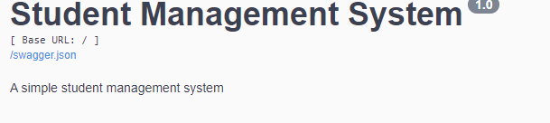
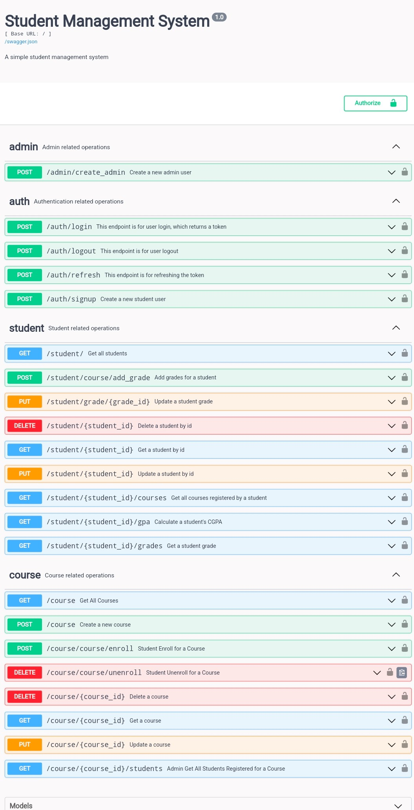

# Student Management System API

<!-- Back to Top Navigation Anchor -->
<a name="readme-top"></a>

<div align="center">
  <a href="https://github.com/Adekemi02/student-management-system">
    
  </a>
</div>


<div align="center">
  <h1>
  </h1>
</div>

<div>
  <p align="center">
    <a href="https://github.com/Adekemi02/student-management-system#readme"><strong>Explore the Docs »</strong></a>
    <br />
    <a href="https://github.com/Adekemi02/student-management-system/blob/main/static/snapshot.png">View Demo</a>
    ·
    <a href="https://github.com/Aadekemi/student-management-system/issues">Report Bug</a>
    ·
    <a href="https://github.com/Adekemi02/student-management-system/issues">Request Feature</a>
  </p>
</div>

<details>
  <summary>Table of Contents</summary>
  <ol>
    <li>
      <a href="#about-student-mgt-api">About Student Management API</a>
      <ul>
        <li><a href="#built-with">Built With</a></li>
      </ul>
    </li>
    <li><a href="#lessons-learned">Lessons Learned</a></li>
    <li><a href="#usage">Usage</a></li>    
    <li><a href="#sample">Sample</a></li>
    <li><a href="#license">License</a></li>
    <li><a href="#contact">Contact</a></li>
    <li><a href="#acknowledgements">Acknowledgements</a></li>
  </ol>
  <p align="right"><a href="#readme-top">back to top</a></p>
</details>

## About Student Management API

This is a web application built with Flask and SQLAlchemy that allows users to manage students and their data.
The Student Management API is a RESTful API which enables users particularly student to register accounts, register for a course and view thier grades of each course they registered. CRUD operations can be carried out on the student data, with an easy-to-use Swagger UI setup for testing and integration with the front end.

Admin creates the student regisration ID, each student is assigned a registration ID when they register their details. Admin perform majority of operations on this app. To be an admin, you will have to register as an admin

Admin can register either through the route or you clone this repository in your local machine and register in your terminal

This student management API was built with Python's Flask-RESTX by  by <a href="https://www.github.com/Adekemi02">Barakat Adisa</a> during Backend Engineering 3rd Semester Exam at <a href="https://altschoolafrica.com/schools/engineering">AltSchool Africa</a> 


## Built with

### Built With:

 


## Lessons Learned

Creating this API, I was able to learn and practice:
* API Development
* App Deployment with Heroku
* Testing
* Documentation
* Debugging
* Routing
* Database Management
* Internet Security
* User Authentication
* User Authorization


## Usage

To use this API, follow these steps:

1. Open the Heroku app on your browser: https://student-managemment-system.herokuapp.com

2. Create an admin or student account

3. Click 'admin' to reveal a dropdown menu for admin route, you can register as an admin via the '/admin/create_admin/' route

4. To register as a student, click on 'auth' to reveal the dropdown menu for the 
authentication and authorization route. You can register as a student via the 
'/auth/signup/' route

5. Sign in via the '/auth/login' route to generate a JWT token. Copy this access token without the quotation marks

6. Scroll up to click "Authorize" at top right corner. Enter the JWT token in this given format:
   ```
   Bearer thejwtaccesstoken
   ```

6. Click 'Authorize' and then 'Close'

7. Now authorized, you can create, view and update courses, students, admins as well as delete student and course via the routes in 'students', 'courses' and 'auth'. You can basically perform the CRUD (create, receive, update, delete) operation on the routes and each routes has its description for easy access. You can as well get:

- All students taking a course
- All courses taken by a student
- Grades and score of each course taken by a student
- You can as well check the GPA of student based on their grades on each course

8. When you're done, click 'Authorize' at top right again to then 'Logout'

Note that to use this in production, you need to fork and clone this repository
and create the admin user from your terminal and comment the '/admin/create_admin' route.

To create the admin from your terminal:
1. Fork the repo and clone

2. Create a new folder and cd into it from your terminal

3. Clone the repo into the folder you created by

```sh

git clone https://github.com/Adekemi02/NetBlog.git

```

4. After cloning, activate your virtual environment by

```sh

python -m venv name_of_your_virtual_env

```
```sh

source name_of_virtual_env/Scripts/activate

```
```sh

macOS: source name_of_virtual_env/bin/activate

```
5. Install flask if you don't have it
6. Install project dependencies

```sh

pip install -r requirements.txt

```
7. Create your database table/schema

```sh

flask shell

```
```sh

db.create_all()

```
8. Create the admin user

```sh

python manage.py create_admin

```
9. This will prompt a user input in your terminal where you input your details and then create the admin user for you.

10. With this onlythe admin can create the admin user.


## Sample

<div align="center">
  <h1>
  </h1>
</div>

## License

Distributed under the MIT License. See <a href="https://github.com/Adekemi02/flaskpizza-api/blob/main/LICENSE">LICENSE</a> for more information.


## Contact

Barakat Adisa - [@adisa_adekhemie](https://twitter.com/adisa_adekhemie) - adisabarakatadekemi@gmail.com

Project Link: [STUDENT MANAGEMENT API](https://github.com/Adekemi02/student-management-system)


## Acknowledgements

This project was made possible by:

* [AltSchool Africa School of Engineering](https://altschoolafrica.com/schools/engineering)
* [Caleb Emelike's Pizza API](https://github.com/CalebEmelike)
* [GitHub Student Pack](https://education.github.com/globalcampus/student)
* Altschool Africa Python Backend Community